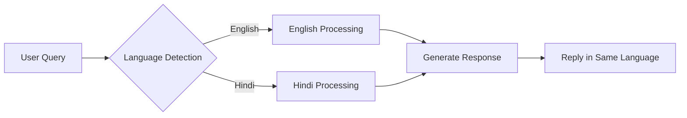
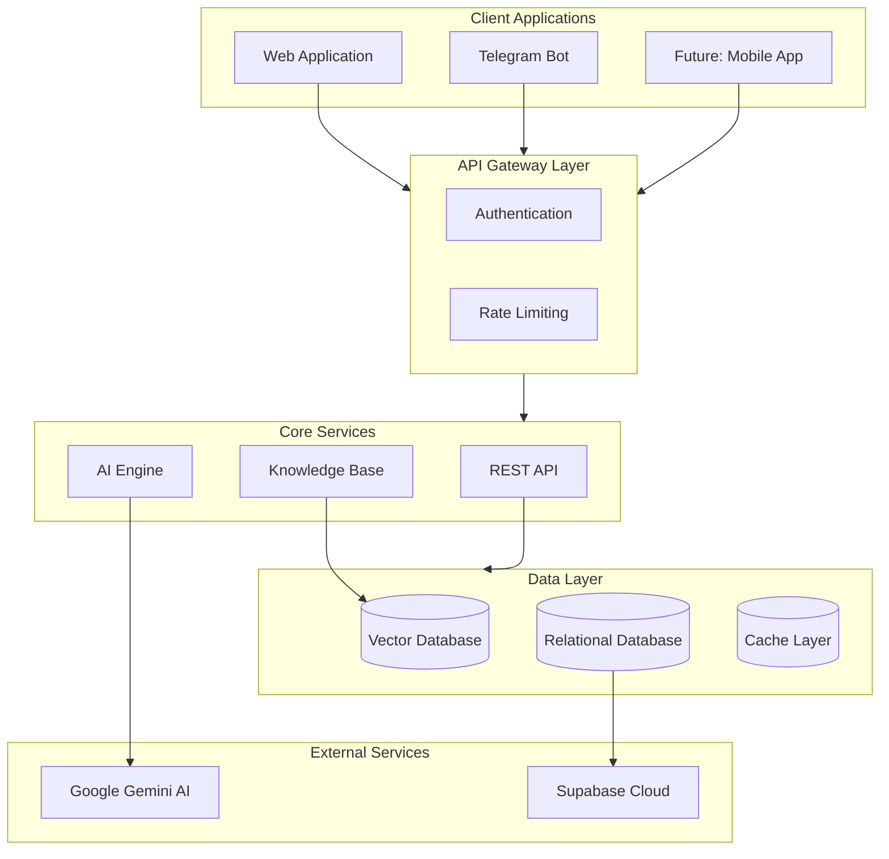
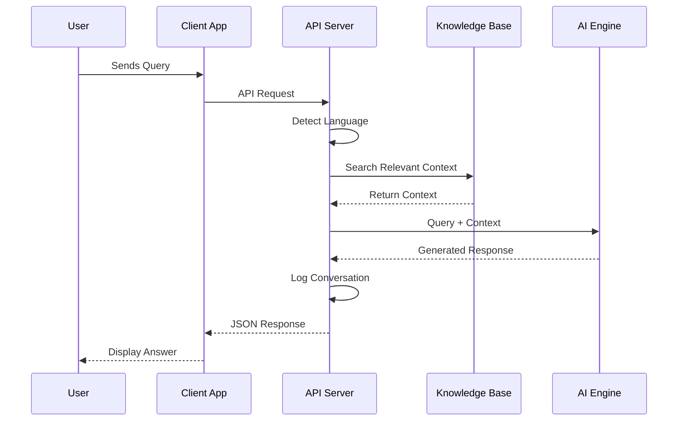
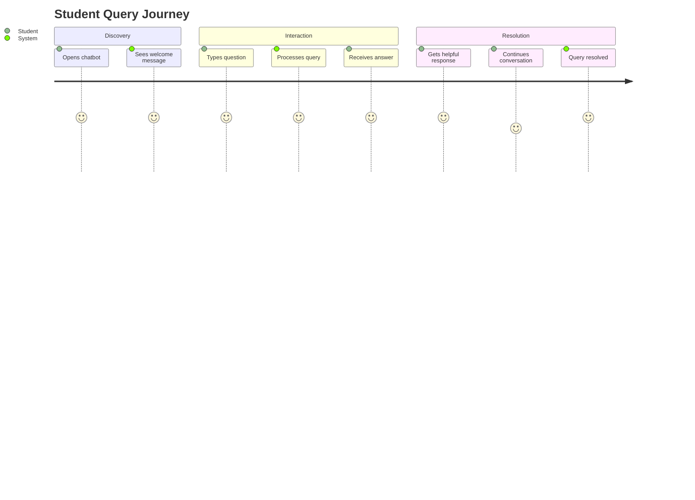
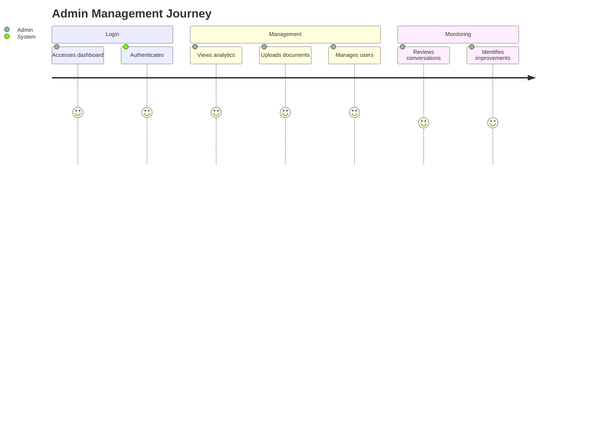
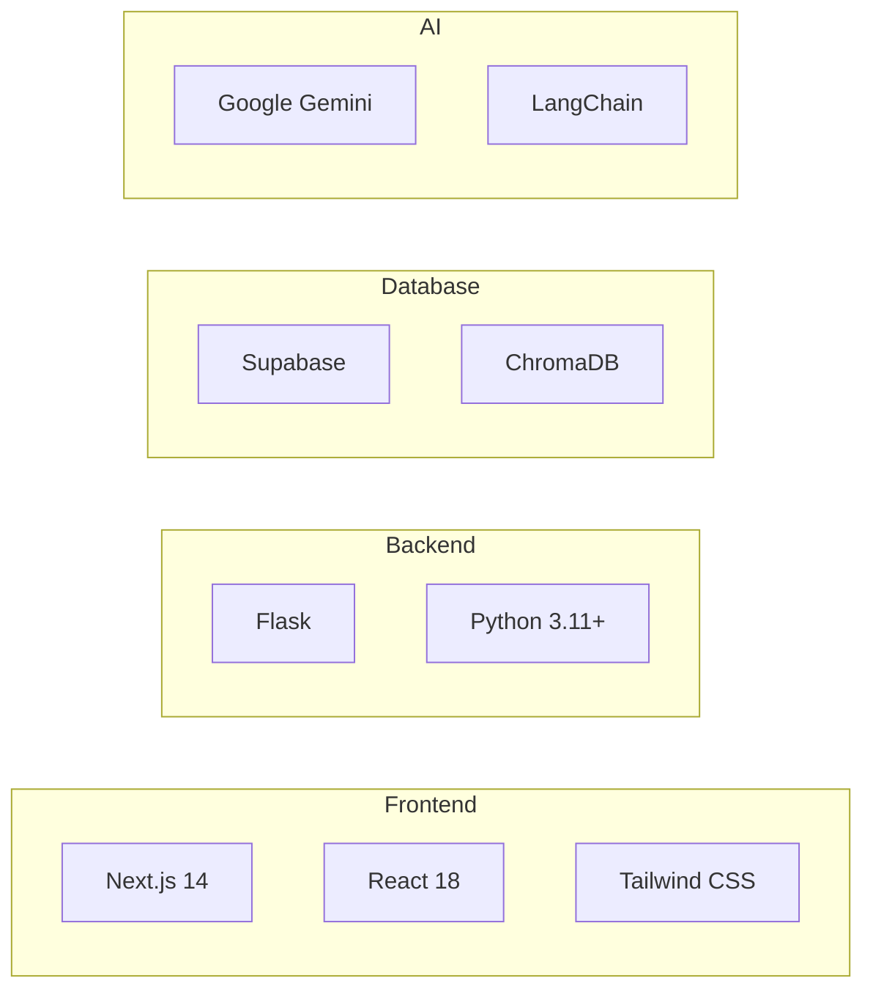
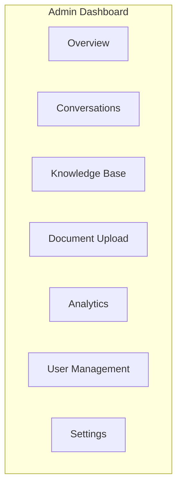
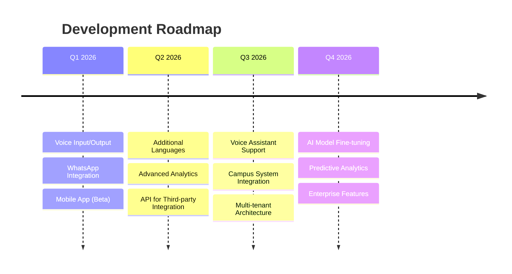

# Campus Assistant Bot

> **An intelligent, multilingual AI-powered campus information assistant that transforms how students interact with university services.**

  

---

---

## Table of Contents

- [Overview](#overview)
- [Key Features](#key-features)
- [System Architecture](#system-architecture)
- [User Journey](#user-journey)
- [Use Cases](#use-cases)
- [Technology Highlights](#technology-highlights)
- [Multi-Platform Support](#multi-platform-support)
- [Admin Dashboard](#admin-dashboard)
- [Screenshots](#screenshots)
- [Demo](#demo)
- [Roadmap](#roadmap)
- [Contact](#contact)

---

## Overview

**Campus Assistant Bot** is a comprehensive AI-powered solution designed to revolutionize campus information delivery. Built with cutting-edge technologies, it provides instant, accurate responses to student queries in multiple languages, available 24/7 across multiple platforms.

### The Problem We Solve

| Challenge | Our Solution |
|-----------|--------------|
| Long queues at information desks | Instant AI responses 24/7 |
| Language barriers for diverse students | Automatic multilingual support |
| Inconsistent information across channels | Single source of truth with knowledge base |
| Limited office hours | Round-the-clock availability |
| Repetitive queries consuming staff time | Automated handling of FAQs |

---

## Key Features

### Intelligent Conversation Engine

  

- **Context-Aware Responses**: Maintains conversation history for coherent multi-turn dialogues
- **Natural Language Understanding**: Processes queries in natural, conversational language
- **Smart Fallback**: Gracefully escalates to human support when needed

### Multilingual Support

- **Automatic Detection**: No manual language selection needed
- **Native Responses**: Replies in the user's preferred language
- **Extensible**: Architecture supports adding new languages

### Dynamic Knowledge Base

- **PDF Document Processing**: Upload campus documents and FAQs
- **Vector Search**: Fast, semantic search across all documents
- **Real-time Updates**: Knowledge base can be updated without downtime
- **Source Attribution**: Know where each answer comes from

### Secure Admin Dashboard

- **Role-Based Access Control**: Administrator and Moderator roles
- **Analytics Dashboard**: Track usage patterns and popular queries
- **User Management**: Manage access and permissions
- **Document Management**: Upload, organize, and maintain knowledge base

---

## System Architecture

### High-Level Architecture

### Request Flow

---

## User Journey

### Student Experience

### Administrator Experience

---

## Use Cases

### For Students

| Query Category | Example Questions |
|----------------|-------------------|
| **Admissions** | "What documents are needed for admission?" |
| **Fees & Payments** | "What is the fee structure for B.Tech?" |
| **Academic Calendar** | "When do exams start?" |
| **Campus Facilities** | "Where is the library located?" |
| **Contact Info** | "How can I reach the registrar office?" |

### For Administrators

| Feature | Benefit |
|---------|---------|
| **Analytics Dashboard** | Track most-asked questions, identify gaps |
| **Knowledge Base Management** | Keep information up-to-date |
| **User Management** | Control access to sensitive features |
| **Conversation Logs** | Quality assurance and improvement |

### For Institutions

| Benefit | Impact |
|---------|--------|
| **Reduced Staff Load** | Free up staff for complex queries |
| **24/7 Availability** | Support students anytime |
| **Consistent Information** | Single source of truth |
| **Multilingual Reach** | Serve diverse student population |

---

## Technology Highlights

### AI & Machine Learning

  

| Component | Technology | Purpose |
|-----------|------------|---------|
| **LLM** | Google Gemini 1.5 | Natural language understanding & generation |
| **Embeddings** | Vector Embeddings | Semantic document search |
| **RAG** | Retrieval-Augmented Generation | Context-aware responses |

### Modern Tech Stack

### Security Features

- **JWT Authentication** with secure token refresh
- **Role-Based Access Control** (RBAC)
- **Secure Session Management**
- **Audit Logging** for all admin actions
- **Environment-based Configuration**

---

## Multi-Platform Support

### Web Application

  

- Responsive design for all devices
- Modern, intuitive chat interface
- Real-time message updates
- Dark/Light theme support

### Telegram Bot

  

- Native Telegram integration
- Inline buttons for quick actions
- Image processing support
- Seamless conversation experience

### Future Platforms

- **Mobile App** (iOS & Android)
- **WhatsApp Integration**
- **Voice Assistant Support**

---

## Admin Dashboard

### Dashboard Overview

  

### Key Modules

| Module | Description |
|--------|-------------|
| **Overview** | Quick stats, recent activity, system health |
| **Conversations** | Browse and search conversation history |
| **Knowledge Base** | View and manage indexed documents |
| **Document Upload** | Add new PDFs to the knowledge base |
| **Analytics** | Usage metrics, popular queries, trends |
| **User Management** | Manage admin and moderator accounts |
| **Settings** | Configure system behavior and responses |

---

## Screenshots

  <i>Screenshots gallery - Add your application screenshots here</i>

### Chat Interface

### Admin Dashboard

### Analytics View

### Document Upload

---

## Demo

  <a href="#">
    
     
    <strong>Watch Product Demo</strong>
  </a>

### Quick Demo Scenarios

1. **Student Query Flow** - See how students get instant answers
2. **Multilingual Conversation** - Watch seamless language switching
3. **Admin Document Upload** - See how easy it is to update knowledge
4. **Analytics Dashboard** - Explore the insights available

---

## Roadmap

### Current Version (v1.0)

- [x] Web chat interface
- [x] Telegram bot integration
- [x] English & Hindi support
- [x] PDF document processing
- [x] Admin dashboard
- [x] User authentication
- [x] Analytics & logging

### Upcoming Features

### Feature Requests

We're always looking to improve! Planned enhancements include:

- Voice input and text-to-speech output
- Native mobile applications
- Support for regional Indian languages
- Advanced predictive analytics
- Integration with campus ERP systems
- WhatsApp Business integration

---

## Contact

### Project Maintainer

  

**Deepender Yadav**

### For Business Inquiries

Interested in implementing Campus Assistant Bot for your institution?

- **Email**: yadavdeepender65@gmail.com
- **Portfolio**: [Coming Soon]

---

## License

This is a **proprietary, closed-source project**. All rights reserved.

Unauthorized copying, modification, distribution, or use of this software, via any medium, is strictly prohibited without explicit written permission from the author.

---

  <strong>Built with passion for better campus experiences</strong>

  © 2025-2026 Deepender Yadav. All Rights Reserved.

